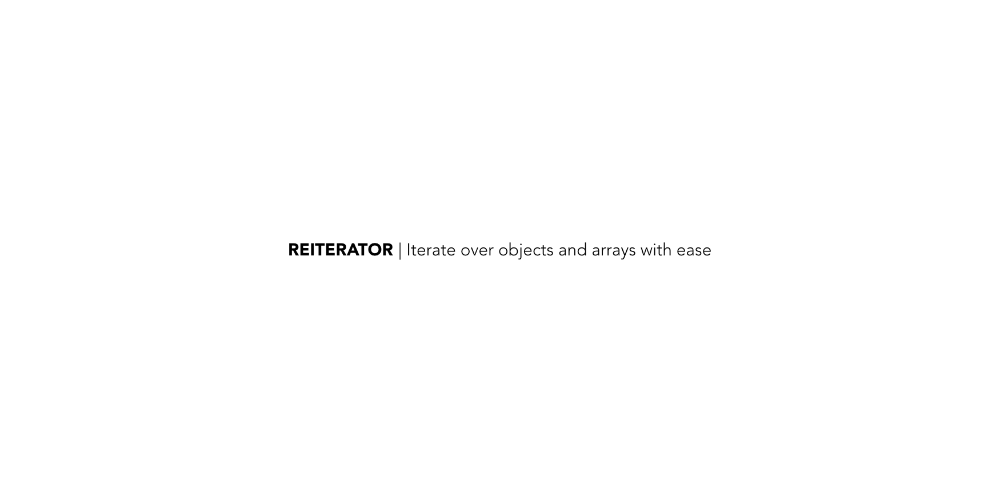

ReIterator is a node.js module which helps you avoid errors while accessing json from the big bad internet (and your own apis)

## About

I created this package to simplify iterating across arrays and objects without hitting into errors. The Iterator is chainable, making it possible to access items as `i.$('first').$(0).$('second).value()`

## Quick Start

```bash
yarn install reiterator
```

```js
const i = require('reiterator')
const value = i.Iterator({'key': 'abc'})
console.log(value)
```

The response should be `abc`

## The complete API

### Iterator functions

The package supports the following functions on the iterator

```js
const obj = { 'abc': [1,2,3,4,5], 'def': { 'ghi': 'jkl', 'mno': 10 }}
i = new Iterator(obj)
i.$('abc').keys() // [1,2,3,4,5]
i.$('def').keys() // []
i.$('def').$('ghi').string() // 'jkl'
i.$('def').$('mno').string() // '10
i.$('def').$('mno').value() // 10
```

What makes it easy is that

- `keys()` always returns an array or []
- `string()` always returns a string or ''

### Object functions

The package support the following functions on objects

```js
const array = i.objects.isArray([123])
const object = i.objects.isObject({ 'key': 'abc'})
const number = i.objects.isNumber(123)
const string = i.objects.isString('asdf')
const hasKey = i.objects.hasKey({'abc':'def'}, 'abc')
```